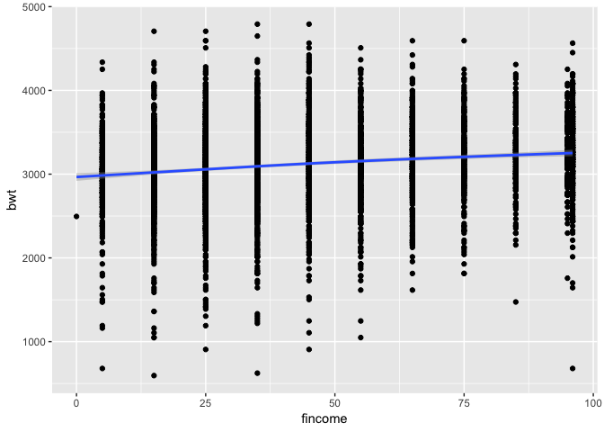
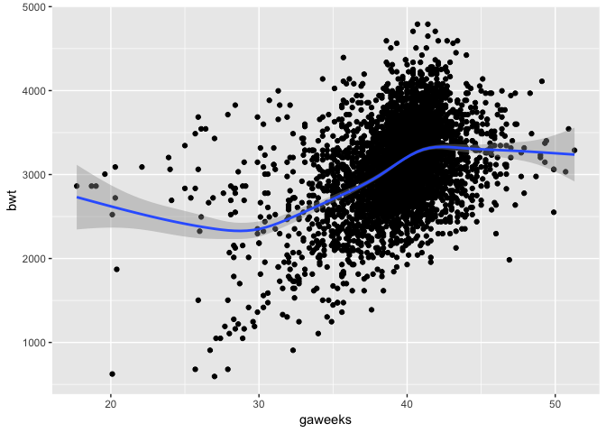
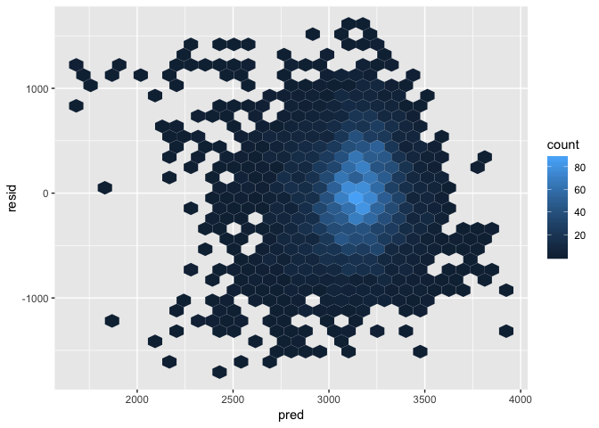
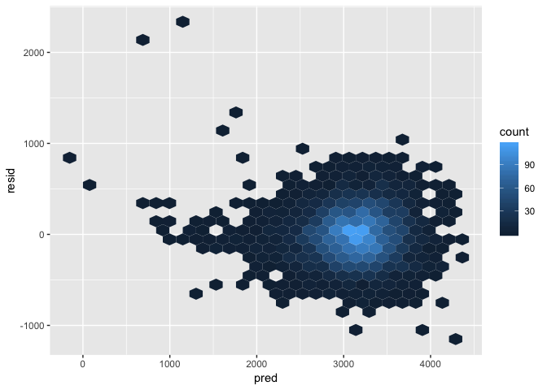
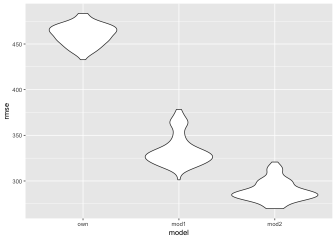
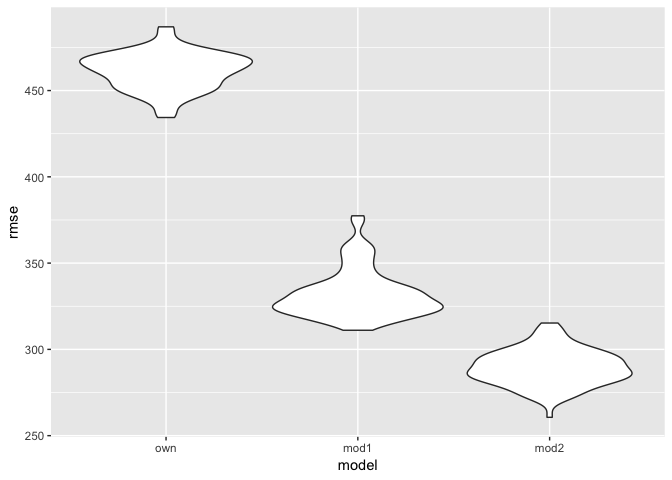

Homework 6
================
Xinyi Lin
11/16/2018

``` r
library(tidyverse)
```

    ## ── Attaching packages ──────────────────────────────────────────────────────────────────────── tidyverse 1.2.1 ──

    ## ✔ ggplot2 3.0.0     ✔ purrr   0.2.5
    ## ✔ tibble  1.4.2     ✔ dplyr   0.7.6
    ## ✔ tidyr   0.8.1     ✔ stringr 1.3.1
    ## ✔ readr   1.1.1     ✔ forcats 0.3.0

    ## ── Conflicts ─────────────────────────────────────────────────────────────────────────── tidyverse_conflicts() ──
    ## ✖ dplyr::filter() masks stats::filter()
    ## ✖ dplyr::lag()    masks stats::lag()

``` r
library(modelr)
```

Problem 1
=========

Import and tidy data
--------------------

``` r
homicide_df = read_csv("./data/homicide-data.csv") %>% 
  mutate(city_state = str_c(city, ", ", state), 
         bin_diposition = ifelse(disposition == "Closed by arrest", 1, 0),
         victim_age = as.numeric(victim_age),
         victim_race = ifelse(victim_race == "White", "white", "non-white"),
         victim_race = relevel(as.factor(victim_race), ref = "white")) %>% 
  #filter(city_state != "Dallas, TX")
  filter(city_state != "Dallas, TX" & city_state != "Phoenix, AZ" & city_state != "Kansas City, MO" & city_state != "Tulsa, AL")
```

    ## Warning in evalq(as.numeric(victim_age), <environment>): NAs introduced by
    ## coercion

``` r
head(homicide_df)
```

    ## # A tibble: 6 x 14
    ##   uid   reported_date victim_last victim_first victim_race victim_age
    ##   <chr>         <int> <chr>       <chr>        <fct>            <dbl>
    ## 1 Alb-…      20100504 GARCIA      JUAN         non-white           78
    ## 2 Alb-…      20100216 MONTOYA     CAMERON      non-white           17
    ## 3 Alb-…      20100601 SATTERFIELD VIVIANA      white               15
    ## 4 Alb-…      20100101 MENDIOLA    CARLOS       non-white           32
    ## 5 Alb-…      20100102 MULA        VIVIAN       white               72
    ## 6 Alb-…      20100126 BOOK        GERALDINE    white               91
    ## # ... with 8 more variables: victim_sex <chr>, city <chr>, state <chr>,
    ## #   lat <dbl>, lon <dbl>, disposition <chr>, city_state <chr>,
    ## #   bin_diposition <dbl>

Baltimore, MD
-------------

``` r
glm_Baltimore =
  homicide_df %>% 
  filter(city_state == "Baltimore, MD") %>% 
  glm(bin_diposition ~ victim_age + victim_sex + victim_race, data = .,family = binomial()) 

#exp(cbind(coef(glm_Baltimore), confint(glm_Baltimore))) %>% 
```

``` r
glm_estimate =
  glm_Baltimore %>% 
  broom::tidy() %>% 
  mutate(OR = exp(estimate)) %>%
  select(term, log_OR = estimate, OR, p.value) 

exp(confint(glm_Baltimore)) %>% 
  broom::tidy() %>% 
  rename(term = .rownames, conf_low = X2.5.., conf_high = X97.5..) %>% 
  inner_join(glm_estimate) %>% 
  select(term, OR, conf_low, conf_high, everything())
```

    ## Waiting for profiling to be done...

    ## Warning: 'tidy.matrix' is deprecated.
    ## See help("Deprecated")

    ## Joining, by = "term"

    ## # A tibble: 4 x 6
    ##   term                    OR conf_low conf_high   log_OR  p.value
    ##   <chr>                <dbl>    <dbl>     <dbl>    <dbl>    <dbl>
    ## 1 (Intercept)          3.27     2.08      5.21   1.19    4.30e- 7
    ## 2 victim_age           0.993    0.987     0.999 -0.00699 3.22e- 2
    ## 3 victim_sexMale       0.412    0.315     0.537 -0.888   6.80e-11
    ## 4 victim_racenon-white 0.441    0.312     0.620 -0.820   2.68e- 6

So, the odds ratio of solving homicides comparing non-white victims to white victims keeping all other variable fixed is 0.44 and the confidence interval is (0.31, 0.62).

Each city
---------

``` r
get_CI = function(model){
  confint(model) %>% 
    exp() %>% 
  #exp(confint(glm_Baltimore)) %>% 
    broom::tidy() %>% 
    rename(term = .rownames, conf_low = X2.5.., conf_high = X97.5..) %>% 
    as.tibble()
}

# test function
get_CI(glm_Baltimore)   
```

    ## # A tibble: 4 x 3
    ##   term                 conf_low conf_high
    ##   <chr>                   <dbl>     <dbl>
    ## 1 (Intercept)             2.08      5.21 
    ## 2 victim_age              0.987     0.999
    ## 3 victim_sexMale          0.315     0.537
    ## 4 victim_racenon-white    0.312     0.620

``` r
glm_Albuquerque =
  homicide_df %>% 
  filter(city_state == "Albuquerque, NM") %>% 
  glm(bin_diposition ~ victim_age + victim_sex + victim_race, data = .,family = binomial()) 

glm_Albuquerque
```

    ## 
    ## Call:  glm(formula = bin_diposition ~ victim_age + victim_sex + victim_race, 
    ##     family = binomial(), data = .)
    ## 
    ## Coefficients:
    ##          (Intercept)            victim_age        victim_sexMale  
    ##              1.23193              -0.02302               0.45470  
    ##    victim_sexUnknown  victim_racenon-white  
    ##              2.10323              -0.29912  
    ## 
    ## Degrees of Freedom: 322 Total (i.e. Null);  318 Residual
    ##   (55 observations deleted due to missingness)
    ## Null Deviance:       411.6 
    ## Residual Deviance: 387.3     AIC: 397.3

``` r
get_CI(glm_Albuquerque)
```

    ## # A tibble: 5 x 3
    ##   term                 conf_low conf_high
    ##   <chr>                   <dbl>     <dbl>
    ## 1 (Intercept)             1.64      7.42 
    ## 2 victim_age              0.964     0.991
    ## 3 victim_sexMale          0.892     2.77 
    ## 4 victim_sexUnknown       2.46     37.7  
    ## 5 victim_racenon-white    0.449     1.22

``` r
cities_glm =
  homicide_df %>% 
  group_by(city_state) %>% 
  nest() %>% 
  mutate(models = map(data, ~glm(bin_diposition ~ victim_age + victim_sex + victim_race, data = .x, family = binomial())), 
         parameters = map(models, broom::tidy)) %>% 
  mutate(CI = map(models, get_CI),
         results = map2(CI, parameters, inner_join)) %>% 
  unnest(results) %>% 
  mutate(OR = exp(estimate)) %>%
  filter(term == "victim_racenon-white") %>% 
  select(city_state, OR, conf_low, conf_high)

head(cities_glm)
```

    ## # A tibble: 6 x 4
    ##   city_state         OR conf_low conf_high
    ##   <chr>           <dbl>    <dbl>     <dbl>
    ## 1 Albuquerque, NM 0.741   0.449      1.22 
    ## 2 Atlanta, GA     0.753   0.424      1.30 
    ## 3 Baltimore, MD   0.441   0.312      0.620
    ## 4 Baton Rouge, LA 0.668   0.304      1.41 
    ## 5 Birmingham, AL  1.04    0.612      1.75 
    ## 6 Boston, MA      0.115   0.0425     0.259

``` r
cities_glm %>% 
  mutate(city_state = fct_reorder(city_state, desc(OR))) %>% 
  ggplot(aes(x = city_state, y = OR)) +
  geom_point() +
  geom_errorbar(aes(ymin = conf_low, ymax = conf_high)) +
  theme(axis.text.x = element_text(angle = 45, hjust = 1))
```



According to this plot, we can find that the confidence intervals of OR in different cities are very different Besides, most estimates of OR are smaller than 1.0, so comparing to white victims there are less solving homicides when victims are non-white.

Problem 2
=========

Import and tidy data
--------------------

``` r
birthweight_df =
  read_csv("./data/birthweight.csv") %>% 
  mutate(frace = as.factor(frace)) 
```

    ## Parsed with column specification:
    ## cols(
    ##   .default = col_integer(),
    ##   gaweeks = col_double(),
    ##   ppbmi = col_double(),
    ##   smoken = col_double()
    ## )

    ## See spec(...) for full column specifications.

``` r
head(birthweight_df)
```

    ## # A tibble: 6 x 20
    ##   babysex bhead blength   bwt delwt fincome frace gaweeks malform menarche
    ##     <int> <int>   <int> <int> <int>   <int> <fct>   <dbl>   <int>    <int>
    ## 1       2    34      51  3629   177      35 1        39.9       0       13
    ## 2       1    34      48  3062   156      65 2        25.9       0       14
    ## 3       2    36      50  3345   148      85 1        39.9       0       12
    ## 4       1    34      52  3062   157      55 1        40         0       14
    ## 5       2    34      52  3374   156       5 1        41.6       0       13
    ## 6       1    33      52  3374   129      55 1        40.7       0       12
    ## # ... with 10 more variables: mheight <int>, momage <int>, mrace <int>,
    ## #   parity <int>, pnumlbw <int>, pnumsga <int>, ppbmi <dbl>, ppwt <int>,
    ## #   smoken <dbl>, wtgain <int>

Propose model
-------------

Hypothesis: Assume `babysex`, `fincome` and `gaweeks` are three main factors which influence baby's birth weight.

First, we test `babysex`

``` r
birthweight_df %>% 
  ggplot(aes(babysex, bwt, group = babysex)) +
  geom_boxplot()
```



According to the results, sex has little influence on baby's birh weight. Then, we test `fincome`.

``` r
birthweight_df %>% 
  ggplot(aes(fincome, bwt)) +
  geom_point() +
  geom_smooth()
```

    ## `geom_smooth()` using method = 'gam' and formula 'y ~ s(x, bs = "cs")'



The plot above shows family monthly income influence average birth weight of baby. Finally, we test `gaweeks`.

``` r
birthweight_df %>% 
  ggplot(aes(gaweeks, bwt)) +
  geom_point() +
  geom_smooth()
```

    ## `geom_smooth()` using method = 'gam' and formula 'y ~ s(x, bs = "cs")'



Gestational age seems to influence baby's birth weight as well. So we create models with three factors. As these three factor have no relationship with each other, we treated them as main effects only.

``` r
own_model = lm(bwt ~ babysex + fincome + gaweeks, data = birthweight_df) 

broom::tidy(own_model)
```

    ## # A tibble: 4 x 5
    ##   term        estimate std.error statistic   p.value
    ##   <chr>          <dbl>     <dbl>     <dbl>     <dbl>
    ## 1 (Intercept)   584.      89.8        6.51 8.64e- 11
    ## 2 babysex       -94.6     14.0       -6.75 1.62e- 11
    ## 3 fincome         2.16     0.271      7.97 1.96e- 15
    ## 4 gaweeks        65.3      2.23      29.3  3.53e-172

``` r
broom::glance(own_model)
```

    ## # A tibble: 1 x 11
    ##   r.squared adj.r.squared sigma statistic   p.value    df  logLik    AIC
    ## *     <dbl>         <dbl> <dbl>     <dbl>     <dbl> <int>   <dbl>  <dbl>
    ## 1     0.191         0.190  461.      341. 9.08e-199     4 -32789. 65588.
    ## # ... with 3 more variables: BIC <dbl>, deviance <dbl>, df.residual <int>

Now, we show the plot of model residuals against fitted values.

``` r
birthweight_df %>% 
  add_predictions(own_model) %>% 
  add_residuals(own_model) %>% 
  ggplot(aes(pred, resid)) +
  geom_hex()
```



Cross validation
----------------

``` r
cv_df = 
  crossv_mc(birthweight_df, 100) %>% 
  mutate(train = map(train, as_tibble),
         test = map(test, as_tibble))
```

``` r
cv_df = 
  cv_df %>% 
  mutate(own_mod = map(train, ~lm(bwt ~ babysex + fincome + gaweeks, data = .x)),
         compared_mod1 = map(train, ~lm(bwt ~ blength + gaweeks, data = .x)),
         compared_mod2 = map(train, ~lm(bwt ~ bhead + blength + babysex + bhead*blength + blength*babysex + babysex*bhead + bhead*blength*babysex, data = .x))) %>% 
  mutate(rmse_own = map2_dbl(own_mod, test, ~rmse(model = .x, data = .y)),
         rmse_mod1 = map2_dbl(compared_mod1, test, ~rmse(model = .x, data = .y)),
         rmse_mod2 = map2_dbl(compared_mod2, test, ~rmse(model = .x, data = .y)))
```

Visualization

``` r
cv_df %>% 
  select(starts_with("rmse")) %>% 
  gather(key = model, value = rmse) %>% 
  mutate(model = str_replace(model, "rmse_", ""),
         model = fct_inorder(model)) %>% 
  ggplot(aes(x = model, y = rmse)) + geom_violin()
```


