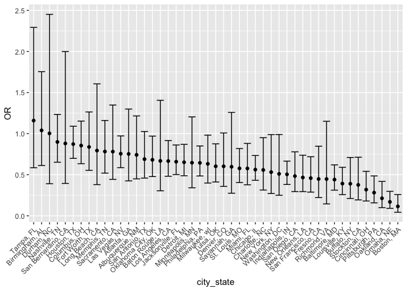
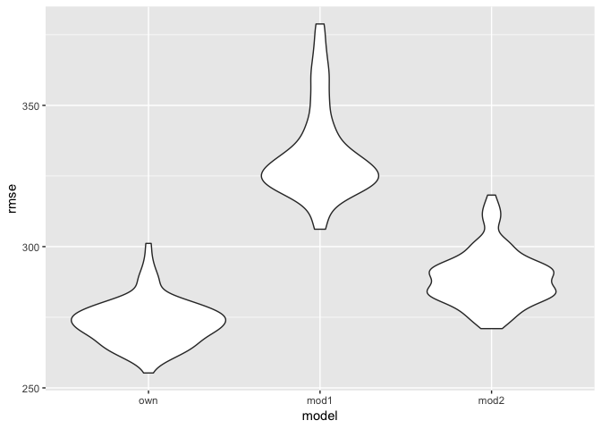

Homework 6
================
Xinyi Lin
11/16/2018

``` r
library(tidyverse)
```

    ## ── Attaching packages ──────────────────────────────────────────────────────────────────────── tidyverse 1.2.1 ──

    ## ✔ ggplot2 3.1.0     ✔ purrr   0.2.5
    ## ✔ tibble  1.4.2     ✔ dplyr   0.7.8
    ## ✔ tidyr   0.8.2     ✔ stringr 1.3.1
    ## ✔ readr   1.1.1     ✔ forcats 0.3.0

    ## ── Conflicts ─────────────────────────────────────────────────────────────────────────── tidyverse_conflicts() ──
    ## ✖ dplyr::filter() masks stats::filter()
    ## ✖ dplyr::lag()    masks stats::lag()

``` r
library(modelr)
```

Problem 1
=========

Import and tidy data
--------------------

``` r
homicide_df = read_csv("./data/homicide-data.csv") %>% 
  mutate(city_state = str_c(city, ", ", state), 
         bin_diposition = ifelse(disposition == "Closed by arrest", 1, 0),
         victim_age = as.numeric(victim_age),
         victim_race = ifelse(victim_race == "White", "white", "non-white"),
         victim_race = relevel(as.factor(victim_race), ref = "white")) %>% 
  filter(city_state != "Dallas, TX" & city_state != "Phoenix, AZ" & city_state != "Kansas City, MO" & city_state != "Tulsa, AL")
```

    ## Warning in evalq(as.numeric(victim_age), <environment>): NAs introduced by
    ## coercion

``` r
head(homicide_df)
```

    ## # A tibble: 6 x 14
    ##   uid   reported_date victim_last victim_first victim_race victim_age
    ##   <chr>         <int> <chr>       <chr>        <fct>            <dbl>
    ## 1 Alb-…      20100504 GARCIA      JUAN         non-white           78
    ## 2 Alb-…      20100216 MONTOYA     CAMERON      non-white           17
    ## 3 Alb-…      20100601 SATTERFIELD VIVIANA      white               15
    ## 4 Alb-…      20100101 MENDIOLA    CARLOS       non-white           32
    ## 5 Alb-…      20100102 MULA        VIVIAN       white               72
    ## 6 Alb-…      20100126 BOOK        GERALDINE    white               91
    ## # ... with 8 more variables: victim_sex <chr>, city <chr>, state <chr>,
    ## #   lat <dbl>, lon <dbl>, disposition <chr>, city_state <chr>,
    ## #   bin_diposition <dbl>

Baltimore, MD
-------------

``` r
glm_Baltimore =
  homicide_df %>% 
  filter(city_state == "Baltimore, MD") %>% 
  glm(bin_diposition ~ victim_age + victim_sex + victim_race, data = .,family = binomial()) 

#exp(cbind(coef(glm_Baltimore), confint(glm_Baltimore))) %>% 
```

``` r
glm_estimate =
  glm_Baltimore %>% 
  broom::tidy()

glm_estimate =
  glm_Baltimore %>% 
  broom::tidy() %>% 
  mutate(OR = exp(estimate)) %>%
  select(term, log_OR = estimate, OR, p.value) 

exp(confint(glm_Baltimore)) %>% 
  broom::tidy() %>% 
  rename(term = .rownames, conf_low = X2.5.., conf_high = X97.5..) %>% 
  inner_join(glm_estimate) %>% 
  select(term, OR, conf_low, conf_high, everything())
```

    ## Waiting for profiling to be done...

    ## Warning: 'tidy.matrix' is deprecated.
    ## See help("Deprecated")

    ## Joining, by = "term"

    ## # A tibble: 4 x 6
    ##   term                    OR conf_low conf_high   log_OR  p.value
    ##   <chr>                <dbl>    <dbl>     <dbl>    <dbl>    <dbl>
    ## 1 (Intercept)          3.27     2.08      5.21   1.19    4.30e- 7
    ## 2 victim_age           0.993    0.987     0.999 -0.00699 3.22e- 2
    ## 3 victim_sexMale       0.412    0.315     0.537 -0.888   6.80e-11
    ## 4 victim_racenon-white 0.441    0.312     0.620 -0.820   2.68e- 6

So, the odds ratio of solving homicides comparing non-white victims to white victims keeping all other variable fixed is 0.44 and the confidence interval is (0.31, 0.62).

Each city
---------

``` r
get_CI = function(model){
  confint(model) %>% 
    exp() %>% 
    broom::tidy() %>% 
    rename(term = .rownames, conf_low = X2.5.., conf_high = X97.5..) %>% 
    as.tibble()
}

# test function
get_CI(glm_Baltimore)   
```

    ## # A tibble: 4 x 3
    ##   term                 conf_low conf_high
    ##   <chr>                   <dbl>     <dbl>
    ## 1 (Intercept)             2.08      5.21 
    ## 2 victim_age              0.987     0.999
    ## 3 victim_sexMale          0.315     0.537
    ## 4 victim_racenon-white    0.312     0.620

``` r
glm_Albuquerque =
  homicide_df %>% 
  filter(city_state == "Albuquerque, NM") %>% 
  glm(bin_diposition ~ victim_age + victim_sex + victim_race, data = .,family = binomial()) 

get_CI(glm_Albuquerque)
```

    ## # A tibble: 5 x 3
    ##   term                 conf_low conf_high
    ##   <chr>                   <dbl>     <dbl>
    ## 1 (Intercept)             1.64      7.42 
    ## 2 victim_age              0.964     0.991
    ## 3 victim_sexMale          0.892     2.77 
    ## 4 victim_sexUnknown       2.46     37.7  
    ## 5 victim_racenon-white    0.449     1.22

``` r
cities_glm =
  homicide_df %>% 
  group_by(city_state) %>% 
  nest() %>% 
  mutate(models = map(data, ~glm(bin_diposition ~ victim_age + victim_sex + victim_race, data = .x, family = binomial())), 
         parameters = map(models, broom::tidy)) %>% 
  mutate(CI = map(models, get_CI),
         results = map2(CI, parameters, inner_join)) %>% 
  unnest(results) %>% 
  mutate(OR = exp(estimate)) %>%
  filter(term == "victim_racenon-white") %>% 
  select(city_state, OR, conf_low, conf_high)

head(cities_glm)
```

    ## # A tibble: 6 x 4
    ##   city_state         OR conf_low conf_high
    ##   <chr>           <dbl>    <dbl>     <dbl>
    ## 1 Albuquerque, NM 0.741   0.449      1.22 
    ## 2 Atlanta, GA     0.753   0.424      1.30 
    ## 3 Baltimore, MD   0.441   0.312      0.620
    ## 4 Baton Rouge, LA 0.668   0.304      1.41 
    ## 5 Birmingham, AL  1.04    0.612      1.75 
    ## 6 Boston, MA      0.115   0.0425     0.259

``` r
cities_glm %>% 
  mutate(city_state = fct_reorder(city_state, desc(OR))) %>% 
  ggplot(aes(x = city_state, y = OR)) +
  geom_point() +
  geom_errorbar(aes(ymin = conf_low, ymax = conf_high)) +
  theme(axis.text.x = element_text(angle = 45, hjust = 1))
```



According to this plot, we can find that the confidence intervals of OR in different cities are very different Besides, most estimates of OR are smaller than 1.0, so comparing to white victims there are less solving homicides when victims are non-white.

Problem 2
=========

Import and tidy data
--------------------

``` r
birthweight_df =
  read_csv("./data/birthweight.csv") %>% 
  mutate(frace = as.factor(frace)) 
```

    ## Parsed with column specification:
    ## cols(
    ##   .default = col_integer(),
    ##   gaweeks = col_double(),
    ##   ppbmi = col_double(),
    ##   smoken = col_double()
    ## )

    ## See spec(...) for full column specifications.

``` r
head(birthweight_df)
```

    ## # A tibble: 6 x 20
    ##   babysex bhead blength   bwt delwt fincome frace gaweeks malform menarche
    ##     <int> <int>   <int> <int> <int>   <int> <fct>   <dbl>   <int>    <int>
    ## 1       2    34      51  3629   177      35 1        39.9       0       13
    ## 2       1    34      48  3062   156      65 2        25.9       0       14
    ## 3       2    36      50  3345   148      85 1        39.9       0       12
    ## 4       1    34      52  3062   157      55 1        40         0       14
    ## 5       2    34      52  3374   156       5 1        41.6       0       13
    ## 6       1    33      52  3374   129      55 1        40.7       0       12
    ## # ... with 10 more variables: mheight <int>, momage <int>, mrace <int>,
    ## #   parity <int>, pnumlbw <int>, pnumsga <int>, ppbmi <dbl>, ppwt <int>,
    ## #   smoken <dbl>, wtgain <int>

Propose model
-------------

We used stepwise regression to find out a suitable model. Stepwise regression helps us to add and remove different factors and compares adjusted r-square to decide an effective model.

``` r
fitted_model <- lm(bwt ~ ., data = birthweight_df)
step(fitted_model, direction = 'both')
```

    ## Start:  AIC=48723.14
    ## bwt ~ babysex + bhead + blength + delwt + fincome + frace + gaweeks + 
    ##     malform + menarche + mheight + momage + mrace + parity + 
    ##     pnumlbw + pnumsga + ppbmi + ppwt + smoken + wtgain
    ## 
    ## 
    ## Step:  AIC=48723.14
    ## bwt ~ babysex + bhead + blength + delwt + fincome + frace + gaweeks + 
    ##     malform + menarche + mheight + momage + mrace + parity + 
    ##     pnumlbw + pnumsga + ppbmi + ppwt + smoken
    ## 
    ## 
    ## Step:  AIC=48723.14
    ## bwt ~ babysex + bhead + blength + delwt + fincome + frace + gaweeks + 
    ##     malform + menarche + mheight + momage + mrace + parity + 
    ##     pnumlbw + ppbmi + ppwt + smoken
    ## 
    ## 
    ## Step:  AIC=48723.14
    ## bwt ~ babysex + bhead + blength + delwt + fincome + frace + gaweeks + 
    ##     malform + menarche + mheight + momage + mrace + parity + 
    ##     ppbmi + ppwt + smoken
    ## 
    ##            Df Sum of Sq       RSS   AIC
    ## - malform   1      1320 321413817 48721
    ## - ppbmi     1      7571 321420068 48721
    ## - momage    1     32877 321445374 48722
    ## - mheight   1     69489 321481986 48722
    ## - menarche  1    108896 321521392 48723
    ## - ppwt      1    135650 321548147 48723
    ## <none>                  321412497 48723
    ## - mrace     1    180162 321592659 48724
    ## - fincome   1    204538 321617035 48724
    ## - parity    1    412356 321824853 48727
    ## - babysex   1    859882 322272379 48733
    ## - gaweeks   1   4636561 326049058 48783
    ## - smoken    1   4906466 326318962 48787
    ## - frace     4   6993136 328405633 48809
    ## - delwt     1   8061047 329473544 48829
    ## - blength   1 102002857 423415353 49918
    ## - bhead     1 106707816 428120312 49966
    ## 
    ## Step:  AIC=48721.15
    ## bwt ~ babysex + bhead + blength + delwt + fincome + frace + gaweeks + 
    ##     menarche + mheight + momage + mrace + parity + ppbmi + ppwt + 
    ##     smoken
    ## 
    ##            Df Sum of Sq       RSS   AIC
    ## - ppbmi     1      7525 321421342 48719
    ## - momage    1     33166 321446983 48720
    ## - mheight   1     69315 321483132 48720
    ## - menarche  1    109185 321523001 48721
    ## - ppwt      1    135587 321549403 48721
    ## <none>                  321413817 48721
    ## - mrace     1    180322 321594138 48722
    ## - fincome   1    203924 321617741 48722
    ## + malform   1      1320 321412497 48723
    ## - parity    1    412160 321825977 48725
    ## - babysex   1    859070 322272887 48731
    ## - gaweeks   1   4635430 326049246 48781
    ## - smoken    1   4905414 326319230 48785
    ## - frace     4   6994994 328408811 48807
    ## - delwt     1   8076910 329490727 48827
    ## - blength   1 102017099 423430916 49916
    ## - bhead     1 106719594 428133410 49964
    ## 
    ## Step:  AIC=48719.26
    ## bwt ~ babysex + bhead + blength + delwt + fincome + frace + gaweeks + 
    ##     menarche + mheight + momage + mrace + parity + ppwt + smoken
    ## 
    ##            Df Sum of Sq       RSS   AIC
    ## - momage    1     33768 321455110 48718
    ## - menarche  1    110834 321532176 48719
    ## <none>                  321421342 48719
    ## - mrace     1    181654 321602996 48720
    ## - fincome   1    205498 321626840 48720
    ## + ppbmi     1      7525 321413817 48721
    ## + malform   1      1273 321420068 48721
    ## - parity    1    410604 321831945 48723
    ## - babysex   1    857801 322279143 48729
    ## - mheight   1   1037401 322458743 48731
    ## - ppwt      1   2910951 324332292 48756
    ## - gaweeks   1   4632739 326054080 48779
    ## - smoken    1   4909681 326331023 48783
    ## - frace     4   6987845 328409187 48805
    ## - delwt     1   8072572 329493914 48825
    ## - blength   1 102027636 423448978 49914
    ## - bhead     1 106866482 428287824 49964
    ## 
    ## Step:  AIC=48717.71
    ## bwt ~ babysex + bhead + blength + delwt + fincome + frace + gaweeks + 
    ##     menarche + mheight + mrace + parity + ppwt + smoken
    ## 
    ##            Df Sum of Sq       RSS   AIC
    ## - menarche  1     92093 321547203 48717
    ## <none>                  321455110 48718
    ## - mrace     1    182821 321637931 48718
    ## - fincome   1    255183 321710292 48719
    ## + momage    1     33768 321421342 48719
    ## + ppbmi     1      8127 321446983 48720
    ## + malform   1      1558 321453551 48720
    ## - parity    1    430203 321885313 48722
    ## - babysex   1    848047 322303157 48727
    ## - mheight   1   1035517 322490626 48730
    ## - ppwt      1   2883480 324338589 48754
    ## - gaweeks   1   4691755 326146864 48779
    ## - smoken    1   4915164 326370274 48782
    ## - frace     4   7591202 329046311 48811
    ## - delwt     1   8042149 329497259 48823
    ## - blength   1 101995731 423450841 49912
    ## - bhead     1 106914493 428369603 49962
    ## 
    ## Step:  AIC=48716.96
    ## bwt ~ babysex + bhead + blength + delwt + fincome + frace + gaweeks + 
    ##     mheight + mrace + parity + ppwt + smoken
    ## 
    ##            Df Sum of Sq       RSS   AIC
    ## <none>                  321547203 48717
    ## - mrace     1    180064 321727267 48717
    ## + menarche  1     92093 321455110 48718
    ## - fincome   1    259196 321806399 48718
    ## + momage    1     15027 321532176 48719
    ## + ppbmi     1      9496 321537707 48719
    ## + malform   1      1742 321545461 48719
    ## - parity    1    421852 321969055 48721
    ## - babysex   1    852888 322400091 48726
    ## - mheight   1    974834 322522036 48728
    ## - ppwt      1   2876741 324423943 48754
    ## - gaweeks   1   4677421 326224624 48778
    ## - smoken    1   4944978 326492181 48781
    ## - frace     4   7564700 329111903 48810
    ## - delwt     1   8178108 329725311 48824
    ## - blength   1 102190532 423737735 49913
    ## - bhead     1 106832496 428379698 49961

    ## 
    ## Call:
    ## lm(formula = bwt ~ babysex + bhead + blength + delwt + fincome + 
    ##     frace + gaweeks + mheight + mrace + parity + ppwt + smoken, 
    ##     data = birthweight_df)
    ## 
    ## Coefficients:
    ## (Intercept)      babysex        bhead      blength        delwt  
    ##  -6106.5802      28.6699     130.8611      74.9660       4.1184  
    ##     fincome       frace2       frace3       frace4       frace8  
    ##      0.3273    -113.9975     -17.4099     -42.6294     -27.3182  
    ##     gaweeks      mheight        mrace       parity         ppwt  
    ##     11.6108       6.4718     -22.3184      96.2006      -2.6614  
    ##      smoken  
    ##     -4.7822

So one of suitable model is `lm(formula = bwt ~ babysex + bhead + blength + delwt + fincome + frace + gaweeks + mheight + mrace + parity + ppwt + smoken, data = birthweight_df)`

``` r
own_model = lm(formula = bwt ~ babysex + bhead + blength + delwt + fincome + frace + gaweeks + mheight + mrace + parity + ppwt + smoken, data = birthweight_df) 

broom::tidy(own_model)
```

    ## # A tibble: 16 x 5
    ##    term         estimate std.error statistic   p.value
    ##    <chr>           <dbl>     <dbl>     <dbl>     <dbl>
    ##  1 (Intercept) -6107.      140.      -43.5   0.       
    ##  2 babysex        28.7       8.46      3.39  7.12e-  4
    ##  3 bhead         131.        3.45     37.9   8.12e-272
    ##  4 blength        75.0       2.02     37.1   1.42e-261
    ##  5 delwt           4.12      0.393    10.5   1.95e- 25
    ##  6 fincome         0.327     0.175     1.87  6.19e-  2
    ##  7 frace2       -114.       17.0      -6.72  2.01e- 11
    ##  8 frace3        -17.4      46.9      -0.371 7.11e-  1
    ##  9 frace4        -42.6      43.0      -0.991 3.22e-  1
    ## 10 frace8        -27.3      73.4      -0.372 7.10e-  1
    ## 11 gaweeks        11.6       1.46      7.93  2.71e- 15
    ## 12 mheight         6.47      1.79      3.62  2.96e-  4
    ## 13 mrace         -22.3      14.3      -1.56  1.20e-  1
    ## 14 parity         96.2      40.4       2.38  1.72e-  2
    ## 15 ppwt           -2.66      0.428    -6.22  5.40e- 10
    ## 16 smoken         -4.78      0.586    -8.16  4.48e- 16

``` r
broom::glance(own_model)
```

    ## # A tibble: 1 x 11
    ##   r.squared adj.r.squared sigma statistic p.value    df  logLik    AIC
    ## *     <dbl>         <dbl> <dbl>     <dbl>   <dbl> <int>   <dbl>  <dbl>
    ## 1     0.718         0.717  273.      733.       0    16 -30504. 61041.
    ## # ... with 3 more variables: BIC <dbl>, deviance <dbl>, df.residual <int>

According to the p-value and r-square, we can conclude that this model is effective. Now, we show the plot of model residuals against fitted values.

``` r
birthweight_df %>% 
  add_predictions(own_model) %>% 
  add_residuals(own_model) %>% 
  ggplot(aes(pred, resid)) +
  geom_hex()
```


Cross validation
----------------

``` r
cv_df = 
  crossv_mc(birthweight_df, 100) %>% 
  mutate(train = map(train, as_tibble),
         test = map(test, as_tibble))
```

``` r
cv_df = 
  cv_df %>% 
  mutate(own_mod = map(train, ~lm(bwt ~ babysex + bhead + blength + delwt + fincome + frace + gaweeks + mheight + mrace + parity + ppwt + smoken, data = .x)),
         compared_mod1 = map(train, ~lm(bwt ~ blength + gaweeks, data = .x)),
         compared_mod2 = map(train, ~lm(bwt ~ bhead + blength + babysex + bhead*blength + blength*babysex + babysex*bhead + bhead*blength*babysex, data = .x))) %>% 
  mutate(rmse_own = map2_dbl(own_mod, test, ~rmse(model = .x, data = .y)),
         rmse_mod1 = map2_dbl(compared_mod1, test, ~rmse(model = .x, data = .y)),
         rmse_mod2 = map2_dbl(compared_mod2, test, ~rmse(model = .x, data = .y)))
```

Visualization

``` r
cv_df %>% 
  select(starts_with("rmse")) %>% 
  gather(key = model, value = rmse) %>% 
  mutate(model = str_replace(model, "rmse_", ""),
         model = fct_inorder(model)) %>% 
  ggplot(aes(x = model, y = rmse)) + geom_violin()
```


